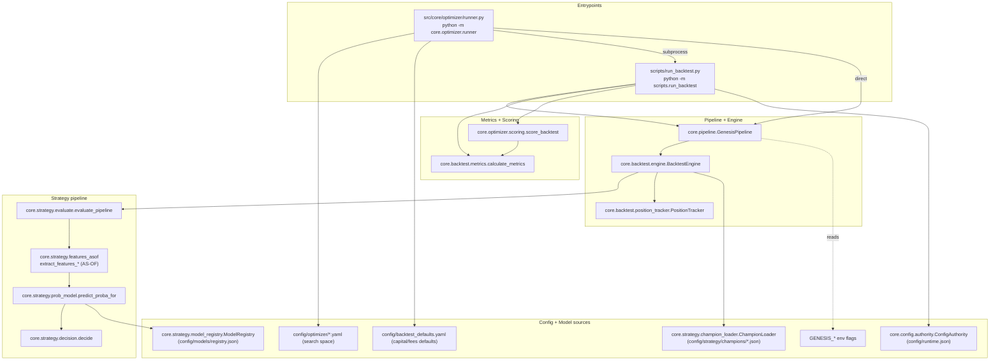
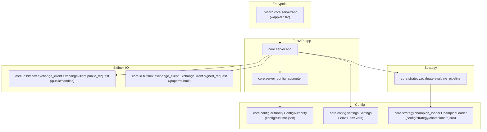
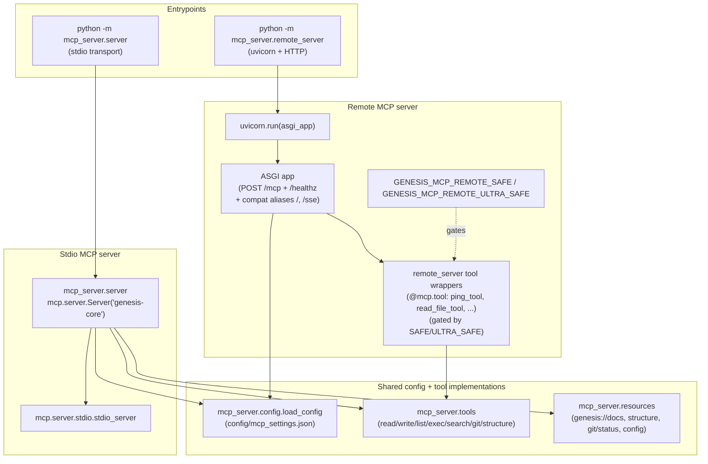
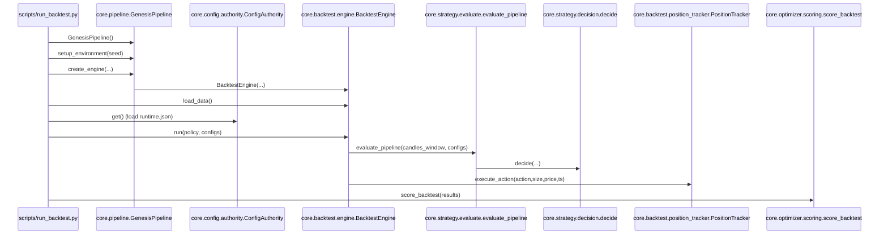
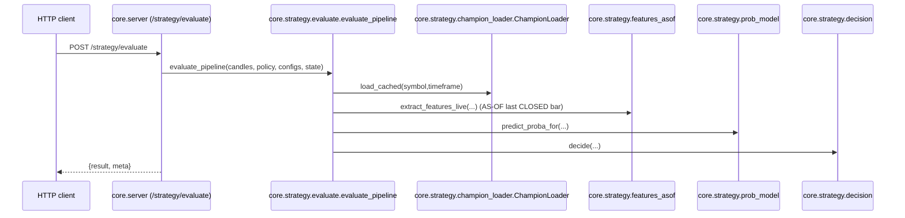
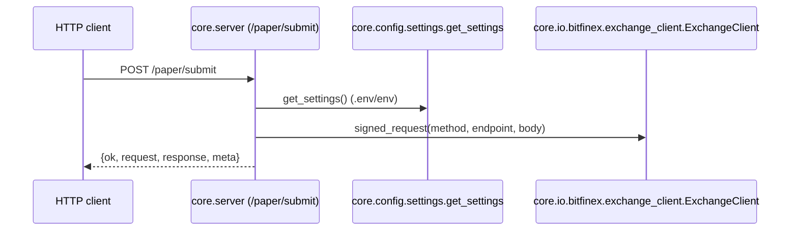
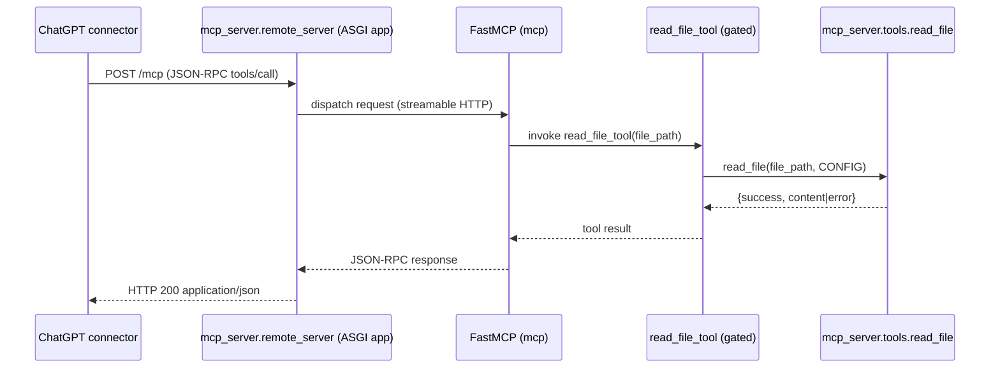
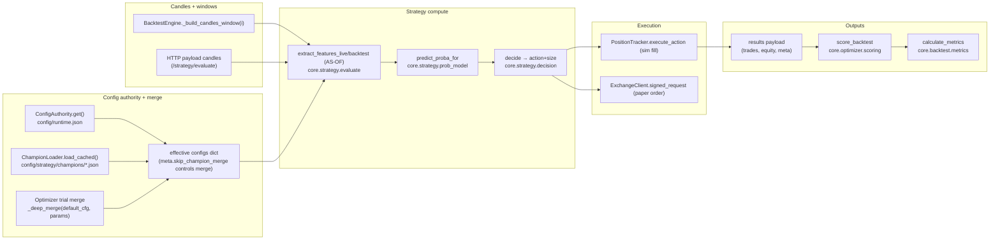
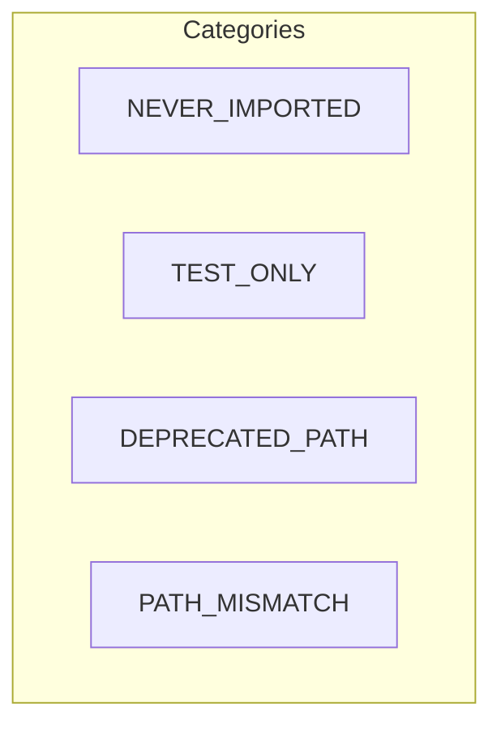

# Genesis-Core — ARCHITECTURE_VISUAL (Mermaid-only, evidence-based)

Read-only repo archaeology. Claims are backed by:

- Code anchors as `path:start-end` (1-based line ranges).
- A reproducible `rg -n ...` command for each diagram arrow.

## Evidence conventions (declare once)

- **Shell assumption:** All command examples in this document are written for **Windows PowerShell 5.1+** unless explicitly stated otherwise.
- **Tooling prerequisite:** This document assumes `rg` (ripgrep) is available on PATH. If not, install ripgrep or use VS Code search as a fallback for the `rg -n ...` steps.
- **Table safety:** Markdown tables break easily. Therefore **no `|` characters** are used inside table cells (especially in `rg` regex patterns). If you need alternation, use **multiple `rg` commands separated by `;`**.
- **Quoting:** Prefer single quotes for regex patterns in PowerShell (example: `rg -n 'pattern' path`).
- **Anchors drift:** Line ranges are evidence anchors, not API. If a range drifts, re-anchor using the adjacent `rg` command(s).

## Primary entrypoints (confirmed)

| Mode                 | How it starts                                                                        | Proof anchor(s)                                                                                                                       | `rg` command                                                                                                                                                                          |
| -------------------- | ------------------------------------------------------------------------------------ | ------------------------------------------------------------------------------------------------------------------------------------- | ------------------------------------------------------------------------------------------------------------------------------------------------------------------------------------- |
| Backtest CLI         | `python -m scripts.run_backtest` (also runnable as `python scripts/run_backtest.py`) | `src/core/optimizer/runner.py:1559-1603` (subprocess uses `-m scripts.run_backtest`) + `scripts/run_backtest.py:547-548` (`__main__`) | `rg -n "scripts\\.run_backtest" src/core/optimizer/runner.py; rg -n "__main__" scripts/run_backtest.py`                                                                               |
| Optimizer/Optuna CLI | `python -m core.optimizer.runner <config.yaml>`                                      | `src/core/optimizer/runner.py:3112-3124` (`run_optimizer`) + `src/core/optimizer/runner.py:3510-3522` (`__main__`)                    | `rg -n "def run_optimizer\\(" src/core/optimizer/runner.py; rg -n "__main__" src/core/optimizer/runner.py`                                                                            |
| API server           | `uvicorn core.server:app --app-dir src` (DEV: add `--reload`)                        | `README.md:22-22` + `src/core/server.py:48-50`                                                                                        | `rg -n "uvicorn core\\.server:app" README.md docs -g"*.md"; rg -n "^app\\s*=\\s*FastAPI" src/core/server.py; rg -n "include_router" src/core/server.py`                               |
| MCP (stdio)          | `python -m mcp_server.server`                                                        | `README.md:42-45` + `mcp_server/server.py:309-337`                                                                                    | `rg -n "python -m mcp_server\\.server" README.md; rg -n "async def main\\(" mcp_server/server.py; rg -n "__main__" mcp_server/server.py`                                              |
| MCP (remote HTTP)    | `python -m mcp_server.remote_server`                                                 | `mcp_server/README.md:23-45` + `mcp_server/remote_server.py:820-859`                                                                  | `rg -n "python -m mcp_server\\.remote_server" mcp_server/README.md; rg -n "def _build_asgi_app\\(" mcp_server/remote_server.py; rg -n "uvicorn\\.run\\(" mcp_server/remote_server.py` |

## 1) Component diagrams (split spines)

### Diagram 1A — Backtest/Optuna spine (components)



Proof checklist (Diagram 1A)

| Arrow                          | Proof anchor(s)                                                                                                                                                                 | `rg` command                                                                                                                                                       |
| ------------------------------ | ------------------------------------------------------------------------------------------------------------------------------------------------------------------------------- | ------------------------------------------------------------------------------------------------------------------------------------------------------------------ |
| `BTCLI -> GP`                  | `scripts/run_backtest.py:42-42` (import) + `scripts/run_backtest.py:143-143` (instantiation)                                                                                    | `rg -n "from core\\.pipeline import GenesisPipeline" scripts/run_backtest.py; rg -n "GenesisPipeline\\(" scripts/run_backtest.py`                                  |
| `GP -> ENG`                    | `src/core/pipeline.py:92-130` (`GenesisPipeline.create_engine()` instantiates `BacktestEngine`)                                                                                 | `rg -n "def create_engine\\(" src/core/pipeline.py; rg -n "BacktestEngine\\(" src/core/pipeline.py`                                                                |
| `ENG -> EVAL`                  | `src/core/backtest/engine.py:784-799` (`evaluate_pipeline(...)`)                                                                                                                | `rg -n "evaluate_pipeline\\(" src/core/backtest/engine.py`                                                                                                         |
| `EVAL -> FEAT`                 | `src/core/strategy/evaluate.py:152-170` (live vs backtest feature selection)                                                                                                    | `rg -n "extract_features_live\\(" src/core/strategy/evaluate.py; rg -n "extract_features_backtest\\(" src/core/strategy/evaluate.py`                               |
| `FEAT -> PROB`                 | `src/core/strategy/evaluate.py:216-224` (`predict_proba_for(...)`)                                                                                                              | `rg -n "predict_proba_for\\(" src/core/strategy/evaluate.py`                                                                                                       |
| `PROB -> DEC`                  | `src/core/strategy/evaluate.py:370-379` (`decide(...)`)                                                                                                                         | `rg -n "\\bdecide\\(" src/core/strategy/evaluate.py`                                                                                                               |
| `ENG -> POS`                   | `src/core/backtest/engine.py:863-877` (`position_tracker.execute_action(...)`)                                                                                                  | `rg -n "position_tracker\\.execute_action\\(" src/core/backtest/engine.py`                                                                                         |
| `BTCLI -> MT`                  | `scripts/run_backtest.py:450-454` (`calculate_metrics(...)`)                                                                                                                    | `rg -n "calculate_metrics\\(" scripts/run_backtest.py`                                                                                                             |
| `BTCLI -> SCORE`               | `scripts/run_backtest.py:455-470` (`score_backtest(...)`)                                                                                                                       | `rg -n "score_backtest\\(" scripts/run_backtest.py`                                                                                                                |
| `SCORE -> MT`                  | `src/core/optimizer/scoring.py:89-100` (`calculate_metrics(...)`)                                                                                                               | `rg -n "def score_backtest\\(" src/core/optimizer/scoring.py; rg -n "calculate_metrics\\(" src/core/optimizer/scoring.py`                                          |
| `BTCLI -> AUTH`                | `scripts/run_backtest.py:310-313` (`authority.get()`) + `src/core/config/authority.py:35-76` (`ConfigAuthority.get()`)                                                          | `rg -n "ConfigAuthority\\(" scripts/run_backtest.py src/core/config/authority.py; rg -n "authority\\.get\\(" scripts/run_backtest.py src/core/config/authority.py` |
| `ENG -> CHAMP`                 | `src/core/backtest/engine.py:679-686` (`champion_loader.load_cached(...)`)                                                                                                      | `rg -n "champion_loader\\.load_cached" src/core/backtest/engine.py`                                                                                                |
| `PROB -> MODELR`               | `src/core/strategy/prob_model.py:61-88` (uses `ModelRegistry`) + `src/core/strategy/model_registry.py:22-25` (`registry.json` path)                                             | `rg -n "ModelRegistry" src/core/strategy/prob_model.py; rg -n "registry\\.json" src/core/strategy/model_registry.py`                                               |
| `OPTCLI -> OPTYAML`            | `src/core/optimizer/runner.py:3112-3124` (`run_optimizer(config_path)` calls `load_search_config(config_path)`) + `src/core/optimizer/runner.py:282-312` (`load_search_config`) | `rg -n "def load_search_config\\(" src/core/optimizer/runner.py; rg -n "load_search_config\\(" src/core/optimizer/runner.py`                                       |
| `OPTCLI -> BTDEF`              | `src/core/optimizer/runner.py:540-579` (`_get_backtest_defaults` reads `config/backtest_defaults.yaml`)                                                                         | `rg -n "def \_get_backtest_defaults\\(" src/core/optimizer/runner.py; rg -n "backtest_defaults\\.yaml" src/core/optimizer/runner.py`                               |
| `OPTCLI -> BTCLI (subprocess)` | `src/core/optimizer/runner.py:1559-1603` (`_build_backtest_cmd` uses `-m scripts.run_backtest`)                                                                                 | `rg -n "def \_build_backtest_cmd\\(" src/core/optimizer/runner.py; rg -n "scripts\\.run_backtest" src/core/optimizer/runner.py`                                    |
| `OPTCLI -> GP (direct)`        | `src/core/optimizer/runner.py:1353-1371` (`from core.pipeline import GenesisPipeline`, `pipeline = GenesisPipeline()`)                                                          | `rg -n "from core\\.pipeline import GenesisPipeline" src/core/optimizer/runner.py; rg -n "pipeline = GenesisPipeline" src/core/optimizer/runner.py`                |
| `GP -.reads.-> ENV`            | `src/core/pipeline.py:61-89` (reads/writes `GENESIS_*`)                                                                                                                         | `rg -n "GENESIS_MODE_EXPLICIT" src/core/pipeline.py; rg -n "GENESIS_FAST_WINDOW" src/core/pipeline.py; rg -n "GENESIS_PRECOMPUTE_FEATURES" src/core/pipeline.py`   |

### Diagram 1B — Live/API spine (components)



Proof checklist (Diagram 1B)

| Arrow             | Proof anchor(s)                                                                                            | `rg` command                                                                                                                           |
| ----------------- | ---------------------------------------------------------------------------------------------------------- | -------------------------------------------------------------------------------------------------------------------------------------- |
| `UV -> APP`       | `README.md:22-22` + `src/core/server.py:48-50`                                                             | `rg -n "uvicorn core\\.server:app" README.md docs -g"*.md"; rg -n "^app\\s*=\\s*FastAPI" src/core/server.py`                           |
| `APP -> ROUTER`   | `src/core/server.py:14-16` (import) + `src/core/server.py:49-49` (`include_router`)                        | `rg -n "server_config_api" src/core/server.py; rg -n "include_router\\(" src/core/server.py`                                           |
| `ROUTER -> AUTH`  | `src/core/server_config_api.py:10-18` (`authority = ConfigAuthority()`, `authority.get()`)                 | `rg -n "authority\\s*=\\s*ConfigAuthority\\(" src/core/server_config_api.py; rg -n "authority\\.get\\(" src/core/server_config_api.py` |
| `APP -> SETTINGS` | `src/core/config/settings.py:8-36` (`env_file=\".env\"`) + `src/core/server.py:831-838` (`get_settings()`) | `rg -n "env_file=\\\"\\.env\\\"" src/core/config/settings.py; rg -n "get_settings\\(" src/core/server.py`                              |
| `APP -> EVAL`     | `src/core/server.py:622-635` (`/strategy/evaluate` calls `evaluate_pipeline`)                              | `rg -n \"/strategy/evaluate\" src/core/server.py; rg -n "evaluate_pipeline\\(" src/core/server.py`                                     |
| `EVAL -> CHAMP`   | `src/core/strategy/evaluate.py:134-146` (`champion_loader.load_cached`, merge)                             | `rg -n "champion_loader\\.load_cached" src/core/strategy/evaluate.py`                                                                  |
| `APP -> PUB`      | `src/core/server.py:638-659` (`/public/candles` uses `public_request`)                                     | `rg -n \"/public/candles\" src/core/server.py; rg -n "public_request\\(" src/core/server.py`                                           |
| `APP -> SIGNED`   | `src/core/server.py:799-809` (`/paper/submit`) + `src/core/server.py:923-926` (`signed_request(...)`)      | `rg -n \"/paper/submit\" src/core/server.py; rg -n "signed_request\\(" src/core/server.py`                                             |

### Diagram 1C — MCP spine (components)



Proof checklist (Diagram 1C)

| Arrow                     | Proof anchor(s)                                                                                                                                           | `rg` command                                                                                                                                                                                                                                         |
| ------------------------- | --------------------------------------------------------------------------------------------------------------------------------------------------------- | ---------------------------------------------------------------------------------------------------------------------------------------------------------------------------------------------------------------------------------------------------- |
| `STDCLI -> STDAPP`        | `mcp_server/README.md:14-19` + `mcp_server/server.py:309-337`                                                                                             | `rg -n "python -m mcp_server\\.server" mcp_server/README.md; rg -n "async def main\\(" mcp_server/server.py; rg -n "__main__" mcp_server/server.py`                                                                                                  |
| `STDAPP -> STDIOTR`       | `mcp_server/server.py:327-334`                                                                                                                            | `rg -n "stdio_server\\(" mcp_server/server.py`                                                                                                                                                                                                       |
| `STDAPP -> MCPCFG`        | `mcp_server/server.py:20-41` (`load_config`, `config = load_config()`) + `mcp_server/config.py:51-75` (default `config/mcp_settings.json`)                | `rg -n "from mcp_server\\.config import load_config" mcp_server/server.py; rg -n "config = load_config\\(" mcp_server/server.py; rg -n "def load_config\\(" mcp_server/config.py; rg -n "mcp_settings\\.json" mcp_server/config.py`                  |
| `STDAPP -> TOOLS`         | `mcp_server/server.py:27-38` (imports) + `mcp_server/server.py:173-229` (dispatch to tool impls)                                                          | `rg -n "from mcp_server\\.tools import" mcp_server/server.py; rg -n "@app\\.call_tool\\(" mcp_server/server.py; rg -n "if name == \"read_file\"" mcp_server/server.py`                                                                               |
| `STDAPP -> RES`           | `mcp_server/server.py:21-26` (imports) + `mcp_server/server.py:266-312` (resource handlers)                                                               | `rg -n "from mcp_server\\.resources import" mcp_server/server.py; rg -n "@app\\.list_resources\\(" mcp_server/server.py; rg -n "@app\\.read_resource\\(" mcp_server/server.py`                                                                       |
| `HTTPCLI -> UV`           | `mcp_server/README.md:23-33` + `mcp_server/remote_server.py:820-859` (`uvicorn.run`)                                                                      | `rg -n "python -m mcp_server\\.remote_server" mcp_server/README.md; rg -n "__main__" mcp_server/remote_server.py; rg -n "uvicorn\\.run\\(" mcp_server/remote_server.py`                                                                              |
| `UV -> ASGI`              | `mcp_server/remote_server.py:755-805` (`_build_asgi_app`, routes) + `mcp_server/remote_server.py:832-859` (`app = _build_asgi_app()`, `uvicorn.run(...)`) | `rg -n "def _build_asgi_app\\(" mcp_server/remote_server.py; rg -n "streamable_http_app\\(" mcp_server/remote_server.py; rg -n "add_route\\(\"/healthz\"" mcp_server/remote_server.py; rg -n "app = _build_asgi_app\\(" mcp_server/remote_server.py` |
| `ASGI -> REMTOOLS`        | `mcp_server/remote_server.py:104-176` (`mcp = _FastMCP(...)`, `@mcp.tool` wrappers)                                                                       | `rg -n "mcp = _FastMCP\\(" mcp_server/remote_server.py; rg -n "@mcp\\.tool\\(" mcp_server/remote_server.py`                                                                                                                                          |
| `REMTOOLS -> TOOLS`       | `mcp_server/remote_server.py:19-26` (imports) + `mcp_server/remote_server.py:142-165` (delegation)                                                        | `rg -n "from \\.tools import" mcp_server/remote_server.py; rg -n "return await read_file\\(" mcp_server/remote_server.py; rg -n "return await execute_python\\(" mcp_server/remote_server.py`                                                        |
| `ENV -.gates.-> REMTOOLS` | `mcp_server/remote_server.py:93-176` (`SAFE_REMOTE_MODE`, `ULTRA_SAFE_REMOTE_MODE`, conditional tool defs) + `mcp_server/README.md:35-38`                 | `rg -n "SAFE_REMOTE_MODE" mcp_server/remote_server.py; rg -n "ULTRA_SAFE_REMOTE_MODE" mcp_server/remote_server.py; rg -n "GENESIS_MCP_REMOTE_SAFE" mcp_server/README.md; rg -n "GENESIS_MCP_REMOTE_ULTRA_SAFE" mcp_server/README.md`                 |

## 2) Sequence diagrams (key modes)

### Diagram 2A — Backtest (sequence)



Proof checklist (Diagram 2A)

| Arrow                             | Proof anchor(s)                                                                         | `rg` command                                                                                                                                                                |
| --------------------------------- | --------------------------------------------------------------------------------------- | --------------------------------------------------------------------------------------------------------------------------------------------------------------------------- |
| `CLI -> Pipe (GenesisPipeline())` | `scripts/run_backtest.py:141-145`                                                       | `rg -n "pipeline\\s*=\\s*GenesisPipeline\\(" scripts/run_backtest.py`                                                                                                       |
| `CLI -> Pipe (setup_environment)` | `scripts/run_backtest.py:272-274` + `src/core/pipeline.py:50-90`                        | `rg -n "setup_environment\\(" scripts/run_backtest.py src/core/pipeline.py`                                                                                                 |
| `CLI -> Pipe (create_engine)`     | `scripts/run_backtest.py:294-305` + `src/core/pipeline.py:92-130`                       | `rg -n "create_engine\\(" scripts/run_backtest.py src/core/pipeline.py`                                                                                                     |
| `Pipe -> Eng`                     | `src/core/pipeline.py:113-130`                                                          | `rg -n "engine\\s*=\\s*BacktestEngine\\(" src/core/pipeline.py`                                                                                                             |
| `CLI -> Eng (load_data)`          | `scripts/run_backtest.py:306-308` + `src/core/backtest/engine.py:234-234`               | `rg -n "engine\\.load_data\\(" scripts/run_backtest.py; rg -n "def load_data\\(" src/core/backtest/engine.py`                                                               |
| `CLI -> Auth (get)`               | `scripts/run_backtest.py:310-313` + `src/core/config/authority.py:73-76`                | `rg -n "authority\\s*=\\s*ConfigAuthority\\(" scripts/run_backtest.py; rg -n "authority\\.get\\(" scripts/run_backtest.py; rg -n "def get\\(" src/core/config/authority.py` |
| `CLI -> Eng (run)`                | `scripts/run_backtest.py:430-436` + `src/core/backtest/engine.py:630-709`               | `rg -n "results\\s*=\\s*engine\\.run\\(" scripts/run_backtest.py; rg -n "def run\\(" src/core/backtest/engine.py`                                                           |
| `Eng -> Eval`                     | `src/core/backtest/engine.py:784-799`                                                   | `rg -n "evaluate_pipeline\\(" src/core/backtest/engine.py`                                                                                                                  |
| `Eval -> Dec`                     | `src/core/strategy/evaluate.py:370-379` + `src/core/strategy/decision.py:108-117`       | `rg -n "action, action_meta\\s*=\\s*decide\\(" src/core/strategy/evaluate.py; rg -n "def decide\\(" src/core/strategy/decision.py`                                          |
| `Eng -> Pos`                      | `src/core/backtest/engine.py:863-877` + `src/core/backtest/position_tracker.py:159-203` | `rg -n "position_tracker\\.execute_action\\(" src/core/backtest/engine.py; rg -n "def execute_action\\(" src/core/backtest/position_tracker.py`                             |
| `CLI -> Score`                    | `scripts/run_backtest.py:455-470` + `src/core/optimizer/scoring.py:89-100`              | `rg -n "score_backtest\\(" scripts/run_backtest.py src/core/optimizer/scoring.py`                                                                                           |

### Diagram 2B — Optimizer/Optuna trial execution (sequence)

```mermaid
sequenceDiagram
  participant Opt as core.optimizer.runner.run_optimizer
  participant YAML as core.optimizer.runner.load_search_config
  participant Defaults as core.optimizer.runner._get_default_config
  participant Auth as core.config.authority.ConfigAuthority
  participant Trial as core.optimizer.runner.run_trial
  participant Direct as core.optimizer.runner._run_backtest_direct
  participant Sub as scripts.run_backtest (subprocess)
  participant Score as core.optimizer.scoring.score_backtest

  Opt->>YAML: load_search_config(config_path)
  Opt->>Defaults: _get_default_config() (cached)
  Defaults->>Auth: get()  (runtime.json)
  Opt->>Trial: run_trial(...)
  Trial->>Trial: merged_cfg=_deep_merge(default_cfg, params)
  Trial->>Trial: meta.skip_champion_merge=True
  Trial->>Direct: _run_backtest_direct(...) (if GENESIS_FORCE_SHELL!=1)
  Trial->>Sub: python -m scripts.run_backtest ... (else)
  Trial->>Score: score_backtest(results)
```

Proof checklist (Diagram 2B)

| Arrow                                  | Proof anchor(s)                                                                     | `rg` command                                                                                                                                                                            |
| -------------------------------------- | ----------------------------------------------------------------------------------- | --------------------------------------------------------------------------------------------------------------------------------------------------------------------------------------- |
| `Opt -> YAML`                          | `src/core/optimizer/runner.py:3112-3124`                                            | `rg -n "def run_optimizer\\(" src/core/optimizer/runner.py; rg -n "load_search_config\\(" src/core/optimizer/runner.py`                                                                 |
| `Opt -> Defaults`                      | `src/core/optimizer/runner.py:1748-1754` (`default_cfg = _get_default_config()`)    | `rg -n "default_cfg\\s*=\\s*_get_default_config\\(" src/core/optimizer/runner.py`                                                                                                       |
| `Defaults -> Auth`                     | `src/core/optimizer/runner.py:508-530` (`ConfigAuthority().get()`)                  | `rg -n "def \_get_default_config\\(" src/core/optimizer/runner.py; rg -n "ConfigAuthority\\(\\)" src/core/optimizer/runner.py; rg -n "authority\\.get\\(" src/core/optimizer/runner.py` |
| `Opt -> Trial`                         | `src/core/optimizer/runner.py:3094-3109` (`return run_trial(...)`)                  | `rg -n "return run_trial\\(" src/core/optimizer/runner.py`                                                                                                                              |
| `Trial -> Trial (_deep_merge)`         | `src/core/optimizer/runner.py:1751-1754`                                            | `rg -n "merged_cfg\\s*=\\s*_deep_merge\\(" src/core/optimizer/runner.py`                                                                                                                |
| `Trial -> Trial (skip_champion_merge)` | `src/core/optimizer/runner.py:1755-1759`                                            | `rg -n "skip_champion_merge" src/core/optimizer/runner.py`                                                                                                                              |
| `Trial -> Direct`                      | `src/core/optimizer/runner.py:1890-1906` (direct path calls `_run_backtest_direct`) | `rg -n "_run_backtest_direct\\(" src/core/optimizer/runner.py`                                                                                                                          |
| `Trial -> Sub`                         | `src/core/optimizer/runner.py:1559-1603` (`-m scripts.run_backtest`)                | `rg -n "scripts\\.run_backtest" src/core/optimizer/runner.py`                                                                                                                           |
| `Trial -> Score`                       | `src/core/optimizer/runner.py:2057-2065` (`score_backtest(...)`)                    | `rg -n "score\\s*=\\s*score_backtest\\(" src/core/optimizer/runner.py`                                                                                                                  |

### Diagram 2C — Live evaluate (API) (sequence)



Proof checklist (Diagram 2C)

| Arrow                      | Proof anchor(s)                                                                  | `rg` command                                                          |
| -------------------------- | -------------------------------------------------------------------------------- | --------------------------------------------------------------------- |
| `Client -> API`            | `src/core/server.py:622-635` (`/strategy/evaluate`)                              | `rg -n "/strategy/evaluate" src/core/server.py`                       |
| `API -> Eval`              | `src/core/server.py:631-635` (`evaluate_pipeline(...)`)                          | `rg -n "evaluate_pipeline\\(" src/core/server.py`                     |
| `Eval -> Champ`            | `src/core/strategy/evaluate.py:134-146` (`champion_loader.load_cached`, merge)   | `rg -n "champion_loader\\.load_cached" src/core/strategy/evaluate.py` |
| `Eval -> Feat`             | `src/core/strategy/evaluate.py:152-163` (live path uses `extract_features_live`) | `rg -n "extract_features_live\\(" src/core/strategy/evaluate.py`      |
| `Eval -> Model`            | `src/core/strategy/evaluate.py:216-224` (`predict_proba_for(...)`)               | `rg -n "predict_proba_for\\(" src/core/strategy/evaluate.py`          |
| `Eval -> Dec`              | `src/core/strategy/evaluate.py:370-379` (`decide(...)`)                          | `rg -n "\\bdecide\\(" src/core/strategy/evaluate.py`                  |
| `API -> Client (response)` | `src/core/server.py:634-635` (`return {"result":..., "meta":...}`)               | `rg -n "return \\{\\\"result\\\"" src/core/server.py`                 |

### Diagram 2D — Paper submit (API → signed order) (sequence)



Proof checklist (Diagram 2D)

| Arrow                      | Proof anchor(s)                                                                                           | `rg` command                                                                           |
| -------------------------- | --------------------------------------------------------------------------------------------------------- | -------------------------------------------------------------------------------------- |
| `Client -> API`            | `src/core/server.py:799-809` (`/paper/submit`)                                                            | `rg -n "/paper/submit" src/core/server.py`                                             |
| `API -> Settings`          | `src/core/server.py:831-838` (`get_settings()`) + `src/core/config/settings.py:32-36`                     | `rg -n "get_settings\\(" src/core/server.py src/core/config/settings.py`               |
| `API -> EC`                | `src/core/server.py:923-926` (`ec.signed_request(...)`) + `src/core/io/bitfinex/exchange_client.py:57-64` | `rg -n "signed_request\\(" src/core/server.py src/core/io/bitfinex/exchange_client.py` |
| `API -> Client (response)` | `src/core/server.py:927-940` (`return {"ok": True, ...}`)                                                 | `rg -n "return \\{\\\"ok\\\"" src/core/server.py`                                      |

### Diagram 2E — MCP remote tool call (HTTP / ChatGPT connector) (sequence)



Proof checklist (Diagram 2E)

| Arrow                           | Proof anchor(s)                                                                                                                           | `rg` command                                                                                                                                                                                                                         |
| ------------------------------- | ----------------------------------------------------------------------------------------------------------------------------------------- | ------------------------------------------------------------------------------------------------------------------------------------------------------------------------------------------------------------------------------------ |
| `Client -> ASGI (POST /mcp)`    | `mcp_server/README.md:23-45` (endpoint) + `mcp_server/remote_server.py:780-805` (discovers `/mcp`, adds `/healthz` + aliases)             | `rg -n "POST /mcp" mcp_server/README.md; rg -n "mcp_route" mcp_server/remote_server.py; rg -n "\"/mcp\"" mcp_server/remote_server.py`                                                                                                |
| `ASGI -> MCP`                   | `mcp_server/remote_server.py:104-115` (`mcp = _FastMCP(...)`) + `mcp_server/remote_server.py:767-777` (`app = mcp.streamable_http_app()`) | `rg -n "mcp = _FastMCP\\(" mcp_server/remote_server.py; rg -n "streamable_http_app\\(" mcp_server/remote_server.py`                                                                                                                  |
| `MCP -> Tool`                   | `mcp_server/remote_server.py:128-176` (`@mcp.tool()` wrappers; conditional exposure)                                                      | `rg -n "@mcp\\.tool\\(" mcp_server/remote_server.py`                                                                                                                                                                                 |
| `Tool -> Core`                  | `mcp_server/remote_server.py:142-142`                                                                                                     | `rg -n "return await read_file\\(" mcp_server/remote_server.py`                                                                                                                                                                      |
| `Core (reads file)`             | `mcp_server/tools.py:24-69` (path safety + `read_text`)                                                                                   | `rg -n "async def read_file\\(" mcp_server/tools.py; rg -n "is_safe_path\\(" mcp_server/tools.py; rg -n "read_text" mcp_server/tools.py`                                                                                             |
| `Tool gating (SAFE/ULTRA_SAFE)` | `mcp_server/remote_server.py:93-176` + `mcp_server/README.md:35-38`                                                                       | `rg -n "SAFE_REMOTE_MODE" mcp_server/remote_server.py; rg -n "ULTRA_SAFE_REMOTE_MODE" mcp_server/remote_server.py; rg -n "GENESIS_MCP_REMOTE_SAFE" mcp_server/README.md; rg -n "GENESIS_MCP_REMOTE_ULTRA_SAFE" mcp_server/README.md` |

## 3) Data-flow diagram (config → data → features → decision → execution → pnl → metrics)



Proof checklist (Data-flow diagram)

| Arrow             | Proof anchor(s)                                                                                                                           | `rg` command                                                                                                                                                       |
| ----------------- | ----------------------------------------------------------------------------------------------------------------------------------------- | ------------------------------------------------------------------------------------------------------------------------------------------------------------------ |
| `RT -> CFG`       | `scripts/run_backtest.py:310-377` (runtime load + merge) + `src/core/config/authority.py:73-76`                                           | `rg -n "ConfigAuthority\\(" scripts/run_backtest.py src/core/config/authority.py; rg -n "authority\\.get\\(" scripts/run_backtest.py src/core/config/authority.py` |
| `CH -> CFG`       | engine merge: `src/core/backtest/engine.py:679-686` + live merge: `src/core/strategy/evaluate.py:140-146`                                 | `rg -n "champion_loader\\.load_cached" src/core/backtest/engine.py src/core/strategy/evaluate.py`                                                                  |
| `TR -> CFG`       | `src/core/optimizer/runner.py:1751-1779` (`merged_cfg` + payload includes `merged_config`)                                                | `rg -n "merged_cfg\\s*=\\s*\_deep_merge\\(" src/core/optimizer/runner.py; rg -n "merged_config" src/core/optimizer/runner.py`                                      |
| `WIN -> FEATS`    | `src/core/backtest/engine.py:784-790` (window build + `_global_index` injection)                                                          | `rg -n "\_build_candles_window\\(" src/core/backtest/engine.py; rg -n "\_global_index" src/core/backtest/engine.py`                                                |
| `PAY -> FEATS`    | `src/core/server.py:622-635` (`payload.get(\"candles\")` → `evaluate_pipeline`)                                                           | `rg -n "payload\\.get\\(\\\"candles\\\"\\)" src/core/server.py; rg -n "evaluate_pipeline\\(" src/core/server.py`                                                   |
| `CFG -> FEATS`    | `src/core/strategy/evaluate.py:157-170` (`extract_features_*` receives `config=configs`)                                                  | `rg -n "extract_features_live\\(" src/core/strategy/evaluate.py; rg -n "extract_features_backtest\\(" src/core/strategy/evaluate.py`                               |
| `FEATS -> PROBA`  | `src/core/strategy/evaluate.py:216-224` (`predict_proba_for(...)`)                                                                        | `rg -n "predict_proba_for\\(" src/core/strategy/evaluate.py`                                                                                                       |
| `PROBA -> ACTION` | `src/core/strategy/evaluate.py:370-379` (`decide(...)`)                                                                                   | `rg -n "\\bdecide\\(" src/core/strategy/evaluate.py`                                                                                                               |
| `ACTION -> SIM`   | `src/core/backtest/engine.py:863-877` (`execute_action(...)`)                                                                             | `rg -n "execute_action\\(" src/core/backtest/engine.py`                                                                                                            |
| `SIM -> RES`      | `src/core/backtest/position_tracker.py:159-203` (mutates trading state + trades)                                                          | `rg -n "def execute_action\\(" src/core/backtest/position_tracker.py`                                                                                              |
| `RES -> SCORE`    | `scripts/run_backtest.py:455-470` (`score_backtest(results)`) + `src/core/optimizer/runner.py:2057-2065` (`score_backtest(results, ...)`) | `rg -n "score_backtest\\(" scripts/run_backtest.py src/core/optimizer/runner.py`                                                                                   |
| `SCORE -> MET`    | `src/core/optimizer/scoring.py:89-100` (score calls `calculate_metrics`)                                                                  | `rg -n "calculate_metrics\\(" src/core/optimizer/scoring.py`                                                                                                       |
| `ACTION -> SIGN`  | `src/core/server.py:923-926` (`signed_request(...)`)                                                                                      | `rg -n "signed_request\\(" src/core/server.py`                                                                                                                     |

## 4) Compact call chains per mode (10–20 lines each)

### Backtest (CLI)

1. Entrypoint `main()` → `GenesisPipeline()` (`scripts/run_backtest.py:141-145`)
2. Canonical mode marker set (`GENESIS_MODE_EXPLICIT`) (`scripts/run_backtest.py:259-266`)
3. `pipeline.setup_environment(seed)` (`scripts/run_backtest.py:272-274` → `src/core/pipeline.py:50-90`)
4. `engine = pipeline.create_engine(...)` (`scripts/run_backtest.py:294-305` → `src/core/pipeline.py:92-130`)
5. `engine.load_data()` (`scripts/run_backtest.py:306-308` → `src/core/backtest/engine.py:234-234`)
6. `cfg_obj, _, runtime_version = ConfigAuthority().get()` (`scripts/run_backtest.py:310-313` → `src/core/config/authority.py:73-76`)
7. Optional `--config-file`: load JSON + merge, OR use top-level `merged_config` (“complete champion”) (`scripts/run_backtest.py:323-377`)
8. `results = engine.run(policy, configs=merged_cfg, ...)` (`scripts/run_backtest.py:430-436` → `src/core/backtest/engine.py:630-709`)
9. Engine merges active champion unless `meta.skip_champion_merge` (`src/core/backtest/engine.py:679-694`)
10. Per-bar window + `_global_index` injection (`src/core/backtest/engine.py:784-790`)
11. `evaluate_pipeline(...)` (`src/core/backtest/engine.py:791-799` → `src/core/strategy/evaluate.py:109-170`)
12. `decide(...)` (`src/core/strategy/evaluate.py:370-379` → `src/core/strategy/decision.py:108-117`)
13. Sim fill: `PositionTracker.execute_action(...)` (`src/core/backtest/engine.py:863-877` → `src/core/backtest/position_tracker.py:159-203`)
14. Metrics + score (`calculate_metrics`, `score_backtest`) (`scripts/run_backtest.py:450-470` → `src/core/optimizer/scoring.py:89-100`)

### Optimizer/Optuna

1. Entrypoint `run_optimizer(config_path)` (`src/core/optimizer/runner.py:3112-3124`)
2. YAML parse `load_search_config(config_path)` (`src/core/optimizer/runner.py:3120-3124` → `src/core/optimizer/runner.py:282-312`)
3. Concurrency env override `GENESIS_MAX_CONCURRENT` (`src/core/optimizer/runner.py:3138-3147`)
4. Backtest economics defaults cached from `config/backtest_defaults.yaml` (`src/core/optimizer/runner.py:540-579`)
5. Trial: `default_cfg = _get_default_config()` (runtime SSOT cached) (`src/core/optimizer/runner.py:1748-1750` → `src/core/optimizer/runner.py:508-530`)
6. Trial: params → `transform_parameters(...)` (`src/core/optimizer/runner.py:1751-1753`)
7. Trial: `merged_cfg = _deep_merge(default_cfg, transformed_params)` (`src/core/optimizer/runner.py:1751-1754`)
8. Trial: force `meta.skip_champion_merge=True` (`src/core/optimizer/runner.py:1755-1759`)
9. Trial: write `trial_XXX_config.json` with `merged_config` + `runtime_version` (`src/core/optimizer/runner.py:1760-1783`)
10. Trial: choose direct vs subprocess (`GENESIS_FORCE_SHELL`) (`src/core/optimizer/runner.py:1887-1908`)
11. Subprocess path uses `python -m scripts.run_backtest ... --config-file` (`src/core/optimizer/runner.py:1559-1604`)
12. Direct path imports `GenesisPipeline` + enforces canonical mode (`src/core/optimizer/runner.py:1353-1371`)
13. Scoring: `score = score_backtest(results, ...)` + constraints (`src/core/optimizer/runner.py:2057-2065`)

### Live/Runtime (strategy evaluation)

1. Entrypoint: `/strategy/evaluate` (`src/core/server.py:622-635`)
2. Handler calls `evaluate_pipeline(candles, policy, configs, state)` (`src/core/server.py:631-635`)
3. `force_backtest_mode = "_global_index" in configs` (controls champion merge) (`src/core/strategy/evaluate.py:128-133`)
4. Champion always loaded: `champion_loader.load_cached(symbol,timeframe)` (`src/core/strategy/evaluate.py:134-137`)
5. Live merge: `_deep_merge(champion_cfg, configs)` when not backtest-mode (`src/core/strategy/evaluate.py:140-146`)
6. Live AS-OF feature extraction uses last CLOSED bar (`extract_features_live`) (`src/core/strategy/evaluate.py:152-163`)
7. Model inference: `predict_proba_for(...)` (`src/core/strategy/evaluate.py:216-224` → `src/core/strategy/prob_model.py:61-88`)
8. Confidence + regime assemble for decision (`src/core/strategy/evaluate.py:233-369`)
9. Decision: `decide(...)` returns `action, action_meta` (`src/core/strategy/evaluate.py:370-379`)
10. Response payload returns `{result, meta}` (`src/core/server.py:634-635`)

### API server (config + IO)

1. Entrypoint: `uvicorn core.server:app --app-dir src` (DEV: add `--reload`) (`README.md:22-22`)
2. ASGI app constructed + router included (`src/core/server.py:48-50`)
3. Config read during startup (lifespan): `_AUTH.get()` (`src/core/server.py:33-43`)
4. `GET /config/runtime` → `authority.get()` (`src/core/server_config_api.py:15-18`)
5. `POST /config/runtime/validate` → `authority.validate(...)` (`src/core/server_config_api.py:21-29`)
6. `POST /config/runtime/propose` → bearer check + `authority.propose_update(...)` (`src/core/server_config_api.py:32-47`)
7. Runtime SSOT path `RUNTIME_PATH = .../config/runtime.json` (`src/core/config/authority.py:15-18`)
8. `GET /public/candles` → `ExchangeClient.public_request(...)` (`src/core/server.py:638-659`)
9. `POST /paper/submit` reads `.env` via `get_settings()` (`src/core/server.py:799-838` → `src/core/config/settings.py:32-36`)
10. Paper order: `ec.signed_request(...)` (`src/core/server.py:923-926` → `src/core/io/bitfinex/exchange_client.py:57-64`)

## 5) Config authority truth table (SSOT + precedence)

| Mode                           | SSOT                                           | Merge inputs                                                                      | Merge location                                                                                                                             | Env overrides                                                                             | Proof (file:lines)                                                                                  |
| ------------------------------ | ---------------------------------------------- | --------------------------------------------------------------------------------- | ------------------------------------------------------------------------------------------------------------------------------------------ | ----------------------------------------------------------------------------------------- | --------------------------------------------------------------------------------------------------- |
| Backtest CLI (default)         | `config/runtime.json` (seed fallback)          | runtime cfg + champion cfg                                                        | engine merges champion unless `meta.skip_champion_merge`: `src/core/backtest/engine.py:679-694`                                            | canonical 1/1 enforced unless explicit: `src/core/pipeline.py:61-89`                      | runtime SSOT: `src/core/config/authority.py:15-76`; CLI loads it: `scripts/run_backtest.py:310-313` |
| Backtest CLI (`--config-file`) | still reads runtime SSOT                       | runtime cfg + override cfg, OR uses top-level `merged_config` (complete champion) | merge/validate + “complete champion” branch: `scripts/run_backtest.py:323-377`                                                             | mode selection marker: `scripts/run_backtest.py:259-266`                                  | “complete champion”: `scripts/run_backtest.py:335-356`                                              |
| Optimizer (trial build)        | cached runtime cfg via `ConfigAuthority.get()` | runtime cfg + trial params                                                        | `_get_default_config()` + `_deep_merge`: `src/core/optimizer/runner.py:508-530` + `src/core/optimizer/runner.py:1751-1754`                 | concurrency override: `GENESIS_MAX_CONCURRENT` (`src/core/optimizer/runner.py:3138-3147`) | YAML load: `src/core/optimizer/runner.py:3112-3124`                                                 |
| Optimizer (anti-drift)         | trial config is authoritative                  | disables implicit champion merge                                                  | sets `meta.skip_champion_merge=True`: `src/core/optimizer/runner.py:1755-1759` (engine respects it: `src/core/backtest/engine.py:679-686`) | direct path forces canonical marker: `src/core/optimizer/runner.py:1358-1363`             | `skip_champion_merge` read: `src/core/backtest/engine.py:679-684`                                   |
| API `/strategy/evaluate`       | request + current champion                     | request configs merged over champion unless backtest-mode (`_global_index`)       | merge decision: `src/core/strategy/evaluate.py:128-146`                                                                                    | `.env`/env vars via Settings: `src/core/config/settings.py:8-36`                          | endpoint: `src/core/server.py:622-635`                                                              |
| API `/config/runtime/*`        | `config/runtime.json`                          | patch over current cfg (whitelist-enforced)                                       | `ConfigAuthority.propose_update(...)`: `src/core/config/authority.py:140-190`                                                              | bearer token check: `src/core/server_config_api.py:32-41`                                 | endpoints: `src/core/server_config_api.py:15-64`                                                    |
| Optimizer economics defaults   | `config/backtest_defaults.yaml`                | (capital, commission, slippage) pinned for run                                    | `_get_backtest_defaults()`: `src/core/optimizer/runner.py:540-579`                                                                         | N/A                                                                                       | subprocess cmd uses those values: `src/core/optimizer/runner.py:1559-1599`                          |

## 6) Reachability-based Ghost/Legacy report (mechanical)

### Categories (required) — diagram has no arrows (N/A proof checklist)



### 6A) Broad reachability run (mechanical)

This run treats as entrypoints:

- all `scripts/*.py` with `__main__` excluding `scripts/archive/`,
- `mcp_server/*.py` with `__main__`,
- `src/core/optimizer/runner.py` (has `__main__`),
- and `core.server` (uvicorn entry).

Algorithm (static; “import reachability”, not dynamic call reachability):

1. Enumerate `src/core/**/*.py` and map to Python module names (packages use `__init__.py` → `core.pkg`).
2. Parse each module with `ast` and collect `import` / `from ... import ...` edges to other `core.*` modules.
3. Seed reachable set from the entrypoint modules (and the `core.*` modules imported by those entrypoint files).
4. Compute transitive closure (DFS/BFS) of the `core.*` import graph.
5. Classify unreachable modules:
   - `DEPRECATED_PATH` if file contains `DEPRECATED` marker (ex: `src/core/strategy/features.py:18-25`)

- `TEST_ONLY` if imported only from `tests/` (including `src.core.*` namespace imports; examples in evidence table below)
- `NEVER_IMPORTED` otherwise (negative evidence via `rg` commands)

Output snapshot (this workspace; AST import-graph reachability):

```text
CORE_TOTAL 97
CORE_REACHABLE 81
CORE_UNREACHABLE 16

COUNTS:
  NEVER_IMPORTED 6
  TEST_ONLY 9
  DEPRECATED_PATH 1

TOP_UNREACHABLE:
  core.backtest.walk_forward [TEST_ONLY]
  core.config.validator [TEST_ONLY]
  core.indicators.fvg [TEST_ONLY]
  core.indicators.macd [NEVER_IMPORTED]
  core.io.bitfinex.ws_reconnect [TEST_ONLY]
  core.ml.overfit_detection [NEVER_IMPORTED]
  core.risk [TEST_ONLY]
  core.risk.guards [TEST_ONLY]
  core.risk.pnl [TEST_ONLY]
  core.risk.sizing [NEVER_IMPORTED]
  core.strategy.e2e [NEVER_IMPORTED]
  core.strategy.ema_cross [TEST_ONLY]
  core.strategy.example [NEVER_IMPORTED]
  core.strategy.features [DEPRECATED_PATH]
  core.strategy.schemas [NEVER_IMPORTED]
  core.strategy.validation [TEST_ONLY]
```

### Diagram 6 — Ghost map (broad run; no arrows)

```mermaid
flowchart TB
  subgraph NEVER_IMPORTED[NEVER_IMPORTED (broad run)]
    MACD[core.indicators.macd]
    OVR[core.ml.overfit_detection]
    SIZ[core.risk.sizing]
    E2E[core.strategy.e2e]
    EX[core.strategy.example]
    SCH[core.strategy.schemas]
  end

  subgraph TEST_ONLY[TEST_ONLY (broad run)]
    WF[core.backtest.walk_forward]
    VAL[core.config.validator]
    FVG[core.indicators.fvg]
    WSREC[core.io.bitfinex.ws_reconnect]
    RISK[core.risk]
    RG[core.risk.guards]
    RPNL[core.risk.pnl]
    EMA[core.strategy.ema_cross]
    VLD[core.strategy.validation]
  end

  subgraph DEPRECATED_PATH[DEPRECATED_PATH (broad run)]
    DEPFEAT[core.strategy.features]
  end
```

Proof checklist (Diagram 6): no arrows.

### Evidence table (broad run unreachable modules)

| Module / asset                                                          | Category          | Evidence (file:lines)                                                                                                                                                     | `rg` command                                                                                                                                                                        |
| ----------------------------------------------------------------------- | ----------------- | ------------------------------------------------------------------------------------------------------------------------------------------------------------------------- | ----------------------------------------------------------------------------------------------------------------------------------------------------------------------------------- |
| `core.strategy.features`                                                | `DEPRECATED_PATH` | `src/core/strategy/features.py:18-40` (docstring says `DEPRECATED`, delegates to ASOF) + `tests/test_dead_code_tripwires.py:8-46` (imports + asserts delegation behavior) | `rg -n 'DEPRECATED' src/core/strategy/features.py; rg -n 'import core\.strategy\.features' tests/test_dead_code_tripwires.py`                                                       |
| `core.config.validator`                                                 | `TEST_ONLY`       | `tests/test_config_endpoints.py:1-5` imports it                                                                                                                           | `rg -n 'core\.config\.validator' tests/test_config_endpoints.py`                                                                                                                    |
| `core.indicators.fvg`                                                   | `TEST_ONLY`       | `tests/test_fvg.py:1-4` imports it                                                                                                                                        | `rg -n 'core\.indicators\.fvg' tests/test_fvg.py`                                                                                                                                   |
| `core.io.bitfinex.ws_reconnect`                                         | `TEST_ONLY`       | `tests/test_ws_reconnect.py:1-4` imports it                                                                                                                               | `rg -n 'core\.io\.bitfinex\.ws_reconnect' tests/test_ws_reconnect.py`                                                                                                               |
| `core.risk.guards`                                                      | `TEST_ONLY`       | `tests/test_risk_guards.py:1-4` imports it                                                                                                                                | `rg -n 'core\.risk\.guards' tests/test_risk_guards.py`                                                                                                                              |
| `core.risk.pnl`                                                         | `TEST_ONLY`       | `tests/test_risk_pnl.py:1-4` imports it                                                                                                                                   | `rg -n 'core\.risk\.pnl' tests/test_risk_pnl.py`                                                                                                                                    |
| `core.strategy.ema_cross`                                               | `TEST_ONLY`       | `tests/test_strategy_ema_cross.py:1-4` imports it                                                                                                                         | `rg -n 'core\.strategy\.ema_cross' tests/test_strategy_ema_cross.py`                                                                                                                |
| `core.strategy.validation`                                              | `TEST_ONLY`       | `tests/test_validation_min.py:1-4` imports it                                                                                                                             | `rg -n 'core\.strategy\.validation' tests/test_validation_min.py`                                                                                                                   |
| `core.backtest.walk_forward`                                            | `TEST_ONLY`       | `tests/test_walk_forward.py:8-60` imports it via `src.core.backtest.walk_forward` (no runtime import-sites under `core.backtest.walk_forward`)                            | `rg -n 'src\.core\.backtest\.walk_forward' tests/test_walk_forward.py; rg -n 'core\.backtest\.walk_forward' -S src scripts mcp_server`                                              |
| `core.indicators.macd`                                                  | `NEVER_IMPORTED`  | no import-site in `src/`, `scripts/` (excluding `scripts/archive/`), or `mcp_server/` (note: used under `scripts/archive/` only)                                          | `rg -n 'core\.indicators\.macd' -S src scripts mcp_server; rg -n 'core\.indicators\.macd' scripts/archive`                                                                          |
| `core.ml.overfit_detection`                                             | `NEVER_IMPORTED`  | no import-site in `src/`, `scripts/` (excluding `scripts/archive/`), or `mcp_server/` (note: referenced by docs/config; treat as “not wired” not “safe to delete”)        | `rg -n 'core\.ml\.overfit_detection' -S src scripts mcp_server`                                                                                                                     |
| `core.risk`                                                             | `TEST_ONLY`       | `tests/test_risk_guards.py:1-4` imports `core.risk.guards`; `tests/test_risk_pnl.py:1-4` imports `core.risk.pnl` (this implicitly imports the `core.risk` package)        | `rg -n 'core\.risk\.guards' tests/test_risk_guards.py; rg -n 'core\.risk\.pnl' tests/test_risk_pnl.py`                                                                              |
| `core.risk.sizing`                                                      | `NEVER_IMPORTED`  | no import-site in `src/`, `scripts/` (excluding `scripts/archive/`), `mcp_server/`, or `tests/`                                                                           | `rg -n 'core\.risk\.sizing' -S src scripts mcp_server tests`                                                                                                                        |
| `core.strategy.e2e` / `core.strategy.example` / `core.strategy.schemas` | `NEVER_IMPORTED`  | no import-site in `src/`, `scripts/` (excluding archive), or `mcp_server/`                                                                                                | `rg -n 'core\\.strategy\\.e2e' -S src scripts mcp_server; rg -n 'core\\.strategy\\.example' -S src scripts mcp_server; rg -n 'core\\.strategy\\.schemas' -S src scripts mcp_server` |

### PATH_MISMATCH (non-Python assets)

These assets exist under `src/config/...` but the loader/writer defaults target repo-root `config/...`:

- Orphaned champions path (quarantined): `archive/_orphaned/src_config_strategy_champions/*` (moved from `src/config/...` to preserve history while eliminating PATH_MISMATCH risk)
  - Loader default: `src/core/strategy/champion_loader.py:13-20` (`CHAMPIONS_DIR = ROOT / "config" / "strategy" / "champions"`)
  - Writer default: `src/core/optimizer/champion.py:67-85` (`repo_root / "config" / "strategy" / "champions"`)

Repro commands:

- `rg -n 'CHAMPIONS_DIR' src/core/strategy/champion_loader.py`
- `rg -n 'champions_dir\s*=\s*champions_dir or' src/core/optimizer/champion.py`
- `Get-ChildItem archive\\_orphaned\\src_config_strategy_champions -File`

## 7) Next actions (safe clean-up checklist)

Note: this section is intentionally the **last section in the file**. Keep it last so action items never end up below it.

1. Quarantine (stability-first) orphaned champions: keep them under `archive/_orphaned/src_config_strategy_champions/*` (do not delete in this PR). If you ever need to restore/migrate, move the desired file(s) into repo-root `config/strategy/champions/` (the loader/writer default) and re-run your baseline checks (`src/core/strategy/champion_loader.py:13-20`, `src/core/optimizer/champion.py:67-85`).
2. For each `NEVER_IMPORTED` module, decide keep vs delete:
   - prove “unused” by running the `rg` commands in the evidence table (Section 6) and confirming no runtime entrypoint imports it.
3. For each `TEST_ONLY` module, decide whether it should be promoted into runtime or moved under `tests/` helpers (evidence table, Section 6).
4. Importtime-gate (recommended before any deletion): capture “what actually executes” using _real entrypoints_ so you also include **local imports inside functions**. Note: `-X importtime` writes to stderr.

- Backtest path: `python -X importtime -m scripts.run_backtest ... 2> logs/importtime_backtest.txt`
- API import baseline: `python -X importtime -c "import core.server; print('core.server imported')" 2> logs/importtime_server_import.txt`
