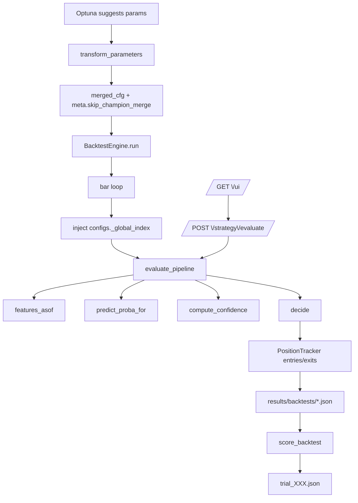

# Runtime Reality Map (Genesis‑Core) 2026-01-22

> Fokus: **Backtest + Optuna** (primära exekveringskedjor) och **API/UI** (sekundära konsumenter).
>
> Målet med denna fil är att göra det svårt att “optimera på luft” genom att visa:
>
> 1. exakt var parametrar **konsumeras**, 2) var de kan **tappa effekt** (skuggas/droppas), och 3) vilka “golden traces” som fångar semantisk drift.

## Rekommendation (praktiskt, för att undvika förvirring)

1. **Canonical/avgörande resultat (Optuna/backtest/validering):** kör via Optuna-runnern eller `BacktestEngine` (inte via API/UI). De vägarna sätter upp determinism‑guardrails, injicerar `_global_index` för precompute-korrekthet och kan låsa bort champion-merge.
2. **När du använder `/strategy/evaluate` för debugging:** var medveten om att den vägen _normalt_ merge:ar in aktiv champion (så resultat kan ändras om champion uppdateras). Om du vill att anropet ska bete sig “backtest-likt”, måste du anropa med en config som triggar backtest-mode (se “Backtest-mode (champion-merge)” nedan).
3. **För långkörningar:** använd “complete config storage” från Optuna (trial config innehåller `merged_config` + `runtime_version`) för att undvika drift om `config/runtime.json` ändras mitt i en körning.

## Scope & bevisförankring

Den här kartan är **evidence-based** och pekar på faktiska artefakter och code paths i repo:

- Optuna-run (jan 16–19): `results/hparam_search/run_20260116_ev_longrun_20260116_20260120/`
  - Metadata: `run_meta.json`
  - Bästa trial (enligt `run_meta.json`): `trial_061.json` (+ tillhörande `trial_061_config.json`)
  - Backtestartifact (enligt `trial_061.json`): `results/backtests/tBTCUSD_1h_20260116_161210.json`

## A) Entrypoints (primära + sekundära)

### Primära (för PnL/metrics/objective)

| Entrypoint        | Var                            | Syfte                                                                      | Vad den matar in i kedjan                                                                    |
| ----------------- | ------------------------------ | -------------------------------------------------------------------------- | -------------------------------------------------------------------------------------------- |
| Optuna/optimizer  | `src/core/optimizer/runner.py` | Genererar parametrar, bygger trial-config, kör backtest, scorerar          | `trial.parameters` → `transform_parameters()` → `merged_cfg` → backtest → `score_backtest()` |
| Backtest (engine) | `src/core/backtest/engine.py`  | Replayar bars, kör strategi-pipeline per bar, bygger trades/equity/metrics | `evaluate_pipeline(candles_window, policy, configs, state)`                                  |
| CLI backtest      | `scripts/run_backtest.py`      | Bygger engine, laddar data, kör engine, skriver resultat                   | `policy + configs` → `BacktestEngine.run()`                                                  |

### Sekundära konsumenter (API/UI)

| Entrypoint         | Var                                                  | Syfte                                                              | Viktigt att förstå                                 |
| ------------------ | ---------------------------------------------------- | ------------------------------------------------------------------ | -------------------------------------------------- |
| UI                 | `src/core/server.py` (`GET /ui`)                     | Minimal web-UI för att skicka JSON till API:et                     | UI är främst för debugging/ops, inte canonical PnL |
| Pipeline via API   | `src/core/server.py` (`POST /strategy/evaluate`)     | Kör `evaluate_pipeline()` på inmatade candles/policy/configs/state | Merge-beteende beror på “backtest-mode” (se nedan) |
| Runtime config API | `src/core/server_config_api.py` (`/config/runtime*`) | Läs/validera/propose runtime config                                | Relevant för att förstå “SSOT config authority”    |

## B) Exekveringskedjor och “authority boundaries”

Det här är “sanningskedjan” från Optuna‑förslag till PnL.

### B1) Optuna → trial config → backtest → score

Kärnflöde (konceptuellt):

1. **Optuna föreslår parametrar** (dict)
2. `transform_parameters(trial.parameters)` (i `src/core/optimizer/runner.py`)
   - Normaliserar/transformerar parameterformat (inkl dot‑notation där det används)
   - Returnerar `transformed_params` + ev. `derived_values`
3. `merged_cfg = deep_merge(default_cfg, transformed_params)`
4. Runnern sätter explicit:
   - `merged_cfg.meta.skip_champion_merge = True` (för att “låsa bort” implicit champion)
   - Skriver `trial_XXX_config.json` som “complete config storage” (inkl. `merged_config` + `runtime_version`)
     - Se `src/core/optimizer/runner.py` där `skip_champion_merge` injiceras i `merged_cfg`.
5. Backtest körs och skriver resultat JSON under `results/backtests/…`
6. `score_backtest(...)` producerar objektivvärde + metrics
7. Runnern skriver `trial_XXX.json` (trial + score + results_path)

Bevis i run 2026‑01‑16:

- `results/hparam_search/run_20260116_ev_longrun_20260116_20260120/trial_061.json`
  - `results_path`: `tBTCUSD_1h_20260116_161210.json`
  - `score.score`: `1.262346...`
  - `score.metrics.num_trades`: `17`

### B2) BacktestEngine (bar-loop) → evaluate_pipeline

I `src/core/backtest/engine.py` sker en tydlig “main loop”:

- Bygger ett `candles_window` per bar
- Injicerar `configs["_global_index"] = i` **på varje bar**
  - Syftet är att `features_asof` ska indexera rätt i precomputed arrays
  - Se `engine.py` runt `configs["_global_index"] = i`
- Kallar:
  - `core.strategy.evaluate.evaluate_pipeline(candles_window, policy, configs, state)`

Det här är centralt för determinism och för att undvika att precomputed arrays används med “fel index”.

### B3) Backtest-mode (champion-merge och varför API/UI kan drifta)

Det finns två “merge-punkter” att hålla i huvudet:

1. **Engine-nivå** (innan bar-loop):

- `BacktestEngine.run()` läser `configs.meta.skip_champion_merge`.
- Om `skip_champion_merge` är **False**:
  - engine laddar champion och deep-merge:ar champion_cfg + configs
- Om `skip_champion_merge` är **True**:
  - champion merge hoppas över

Bevis: `src/core/backtest/engine.py`

- `skip_champion_merge = bool(meta.get("skip_champion_merge"))`
- `if not skip_champion_merge: ... configs = self._deep_merge(champion_cfg.config, configs)`

2. **Pipeline-nivå** (`evaluate_pipeline`):

- `evaluate_pipeline()` avgör “backtest-mode” via:
  - `force_backtest_mode = "_global_index" in configs`
- Om `force_backtest_mode` är **True**:
  - `configs` behandlas som **authoritative** och champion merge sker **inte** här
- Om `force_backtest_mode` är **False**:
  - pipeline merge:ar in champion (om `configs` är tom/partial)

Bevis: `src/core/strategy/evaluate.py`

- `force_backtest_mode = "_global_index" in configs`
- else‑grenen deep-merge:ar champion.

Konsekvens:

- Backtest/Optuna får stabila gränser: champion merge (0 eller 1 gång) och sedan `_global_index` per bar.
- API‑endpointen `/strategy/evaluate` (utan `_global_index`) kommer i normalfallet att merge:a in aktiv champion → resultat kan drifta över tid.

### B4) Strategy pipeline: features → proba → confidence → decision

Kärnorkestrering sker i `src/core/strategy/evaluate.py`:

1. `extract_features(...)` (SSOT) → `core.strategy.features_asof.extract_features`
2. `detect_regime_unified(...)` (eller EMA50 fast-path om precomputed)
3. `predict_proba_for(symbol, timeframe, feats, regime=...)`
4. `compute_confidence(...)` (och ev. quality‑scaling)
5. `decide(...)` (gates, trösklar, HTF/LTF fib, sizing, reasons)

### B5) ATR-adaptation: varför vissa threshold-parametrar “tappar effekt”

`decide()` (i `src/core/strategy/decision.py`) har explicit logik:

- Om `thresholds.signal_adaptation` är definierad _och_ `state.atr_percentiles` finns:
  - zon (`low/mid/high`) väljs via percentiler
  - `default_thr` och `thresholds` kan tas från zon‑cfg
- Annars används basvärden (`thresholds.entry_conf_overall`, `thresholds.regime_proba`)

Bevis:

- `src/core/strategy/decision.py`:
  - `adaptation_cfg = thresholds_cfg.get("signal_adaptation") or {}`
  - `atr_percentiles = state_in.get("atr_percentiles") if adaptation_cfg else None`

`evaluate_pipeline()` sätter `state["atr_percentiles"] = feats_meta.get("atr_percentiles")`.

Bevis:

- `src/core/strategy/evaluate.py`:
  - `"atr_percentiles": feats_meta.get("atr_percentiles")`

`features_asof` beräknar **endast** percentiler för perioderna `(14, 28, 56)` och lägger dem i `atr_percentiles` som strängnycklar.

Bevis:

- `src/core/strategy/features_asof.py`:
  - `for period in (14, 28, 56): ... atr_percentiles[str(period)] = {"p40": ..., "p80": ...}`

## C) Parametrar som tappar effekt (“inerta/skuggade”) – med orsak

Det här avsnittet är medvetet konservativt: vi skiljer på “konfirmerat” och “troligt”.

### C0) Snabbmatris: när en parameter har noll (eller nära noll) effekt

| Parameter                                 | Har noll/nästan noll effekt när…                                                            | Varför                                                                                                           | Konsumeras av                                                                                 |
| ----------------------------------------- | ------------------------------------------------------------------------------------------- | ---------------------------------------------------------------------------------------------------------------- | --------------------------------------------------------------------------------------------- |
| `meta.skip_champion_merge`                | Du kör via `POST /strategy/evaluate` (dvs direkt `evaluate_pipeline` utan `BacktestEngine`) | Flaggan läses i `BacktestEngine.run()`, inte i `evaluate_pipeline()`                                             | `src/core/backtest/engine.py` (engine-nivå merge)                                             |
| `thresholds.entry_conf_overall`           | `thresholds.signal_adaptation` är aktiv och zon-cfg har `entry_conf_overall`                | `decide()` ersätter `default_thr` med zonens värde                                                               | `src/core/strategy/decision.py`                                                               |
| `thresholds.regime_proba.*`               | `thresholds.signal_adaptation` är aktiv och zon-cfg har `regime_proba`                      | `decide()` väljer `thresholds = zone_regime or thresholds_cfg.get("regime_proba")`                               | `src/core/strategy/decision.py`                                                               |
| `thresholds.signal_adaptation.atr_period` | `atr_period` inte finns i `atr_percentiles` (normalt endast 14/28/56)                       | Zon-gränser (`p40/p80`) faller tillbaka till `atr` → zon tenderar att bli `low` och blir i praktiken “låst”      | `src/core/strategy/decision.py` + `src/core/strategy/features_asof.py`                        |
| `configs._global_index`                   | Du kör via API/UI och inte sätter `_global_index`                                           | Ingen backtest-mode → champion merge kan ske i pipeline och precomputed-indexering kan bli annorlunda/irrelevant | `src/core/strategy/evaluate.py` (backtest-mode trigger + EMA50-index)                         |
| `configs.precomputed_features.*`          | Du kör utan `BacktestEngine` (som injicerar precomputed) eller utan precompute-path         | Utan injection finns inga precomputed arrays att använda (slow path används)                                     | `src/core/backtest/engine.py` (injection) + `src/core/strategy/evaluate.py` (EMA50 fast-path) |

### C1) Konfirmerat: skuggning via signal_adaptation

**Symptom:** du ändrar `thresholds.entry_conf_overall` men antalet trades / gating ändras inte som du förväntar dig.

**Orsak:** när `thresholds.signal_adaptation` används, tar `decide()` primärt trösklar från zon‑cfg.

- Skuggar (eller minskar betydelsen av):
  - `thresholds.entry_conf_overall`
  - `thresholds.regime_proba.<regime>`
- Konsumeras istället via:
  - `thresholds.signal_adaptation.zones.<low/mid/high>.entry_conf_overall`
  - `thresholds.signal_adaptation.zones.<...>.regime_proba`

**Viktigt edge case (konfirmerat via kod):**

- Om `signal_adaptation.atr_period` sätts till något _annat_ än 14/28/56, så finns normalt inga percentiler för den perioden.
- I `decision.py` faller zon-beräkningen då tillbaka till `p40=atr` och `p80=atr` vilket gör att zon oftast blir `low` (eftersom `atr <= p40`).

Det betyder att `atr_period` kan “låsa zonen” utan att du märker det om du inte loggar zon/debug.

### C2) Konfirmerat: champion-merge kan maskera förändringar i API/UI

**Symptom:** `/strategy/evaluate` ändrar beteende efter att champion uppdaterats, trots att du skickar samma payload.

**Orsak:** `evaluate_pipeline()` merge:ar champion när `_global_index` saknas (dvs när den inte kör i backtest-mode).

Bevis: `src/core/strategy/evaluate.py` (se B3).

### C3) Konfirmerat: `skip_champion_merge` är engine‑nivå, inte pipeline‑nivå

**Vad det betyder:**

- I backtests styr `meta.skip_champion_merge` om champion merge sker i `BacktestEngine.run()`.
- Men `evaluate_pipeline` tittar **inte** på `skip_champion_merge`; den tittar på `_global_index`.

Alltså: om du kör pipeline utanför engine (t.ex. via API), kommer `skip_champion_merge` inte hjälpa om du inte också triggar backtest-mode.

Bevis:

- `BacktestEngine.run()` läser `meta.skip_champion_merge` (engine.py)
- `evaluate_pipeline()` läser `_global_index` (evaluate.py)

### C4) Troligt (men värt att övervaka): parameterformat som bara Optuna transform:ar

Vissa parametertyper kan vara “Optuna-specifika”:

- Parametrar som förutsätter `transform_parameters()` för att bli giltiga runtime-configs.

Praktisk risk:

- Om du försöker mata samma parametrar direkt via `/strategy/evaluate` utan att först transformera dem till den faktiska runtime‑formen kan de bli inert.

Åtgärd:

- För golden traces: jämför “raw trial parameters” vs “merged_config” som faktiskt gick in i backtest.

### C5) Konfirmerat “spooky/legacy”: `core.strategy.features` innehåller dead code efter return

`src/core/strategy/features.py` är markerad DEPRECATED och delegaterar till `features_asof` — men filen innehåller också en stor mängd legacy‑kod **efter** en `return` (dvs oexekverbar i nuvarande flöde).

Det är inte en runtime‑bug, men en underhållsrisk:

- framtida ändringar kan råka “återaktivera” legacy‑delen, eller en läsare kan tro att den är aktiv.

Bevis:

- `features.py`: `return _extract_features_asof(...)` följs av en docstring och legacy implementation.

## D) Golden-trace tester – fånga semantisk drift

De här testerna är tänkta som “tysta larm”: de failar när **semantik** ändras (merge‑regler, index‑authority,
threshold‑gating), inte bara när enskilda siffror rör sig.

Samtliga nedan är CI-säkra (de läser inte `results/`, som är gitignored).

Implementationer:

- `tests/test_golden_trace_runtime_semantics.py` (fingerprint + `signal_adaptation`)
- `tests/test_evaluate_pipeline_config_isolation.py` (backtest-mode authority vs live-mode champion merge)

### Test 1: Config fingerprint scrub (traceability)

**Mål:** Fingerprint ska vara stabilt för “samma effektiva config” även om volatila/cache‑nycklar ändras.

**Implementerad invariant:**

- `BacktestEngine._config_fingerprint()` måste ignorera:
  - `configs._global_index`
  - `configs.precomputed_features`
  - `configs.meta.champion_loaded_at`

Detta skyddar reproducibility/traceability (fingerprint ska inte ”drifta” p.g.a. index eller cache‑payloads).

### Test 2: Backtest-mode authority – champion-merge får inte smyga in

**Mål:** Bevisa att `evaluate_pipeline()` inte merge:ar champion när `_global_index` är satt (backtest-mode),
men gör det när `_global_index` saknas (live/API-mode).

**Implementerad invariant:**

- `tests/test_evaluate_pipeline_config_isolation.py`:
  - `test_evaluate_pipeline_does_not_merge_champion_in_backtest_mode`
  - `test_evaluate_pipeline_merges_champion_in_live_mode`

### Test 3: ATR-adaptation contract – zonval och skuggning av baströsklar

**Mål:** Fånga regressioner där `signal_adaptation` slutar fungera, eller där zonerna gör att baströsklar blir
“inerta” utan att vi märker det.

**Implementerad invariant:**

- Direkt unit-test av `core.strategy.decision.decide()` med minimal state:
  - Verifierar att zonval (`ZONE:<...>@...`) produceras.
  - Verifierar att zon‑cfg kan skugga baströsklar (en vanlig källa till “inerta” parametrar).
  - Verifierar nuvarande fallback-semantik när `atr_period` saknar percentiler (zon tenderar att bli `low`).

## Case study: run_20260116_ev_longrun_20260116_20260120 (jan 16–19)

### Run-identitet

- Run-dir: `results/hparam_search/run_20260116_ev_longrun_20260116_20260120/`
- `run_meta.json` refererar bl.a.
  - `storage`: `sqlite:///results/hparam_search/storage/optuna_tBTCUSD_1h_ev_longrun_20260116_20260120.db`
  - `study_name`: `optuna_ev_longrun_20260116_20260120_explore2024_validate2025`
  - `best_trial_id`: `trial_061`

### Bästa trial: trial_061

- `trial_061.json` innehåller både `parameters` och `merged_config`.
- Score/metrics (utdrag):
  - `score.score`: `1.262346...`
  - `score.metrics.total_return`: `0.04705...` (≈ +4.705%)
  - `score.metrics.profit_factor`: `2.898...` (trial-score view)
  - `score.metrics.num_trades`: `17`

Backtestartifact:

- `results/backtests/tBTCUSD_1h_20260116_161210.json`
  - `backtest_info.execution_mode.fast_window = true`
  - `backtest_info.htf.env_htf_exits = "1"`
  - `backtest_info.effective_config_fingerprint = a78bc228...`

### En konkret “reason chain” (hur man läser effekten)

I samma backtestartifact ser man i `trades[*].entry_reasons` t.ex.:

- `"ZONE:low@0.270"`
- `"ENTRY_LONG"`

Detta visar att **zon‑tröskeln** (signal_adaptation) var aktiv i gatingen.

I `trades[*].entry_fib_debug` ser man också hur fib-gates faktiskt betedde sig. Exempel:

- HTF: `reason = "UNAVAILABLE_PASS"` och `missing_levels = [0.382, 0.5, 0.618, 0.786]`
- LTF: `reason = "PASS"` med en explicit `tolerance` och config (long_max_level/short_min_level)

Det är exakt den typen av “runtime reality” man vill spara/ha tester för: inte bara att en parameter finns i config, utan att den ger ett spår i beslut/trade metadata.

## Appendix: Snabb “graph” (Mermaid)

