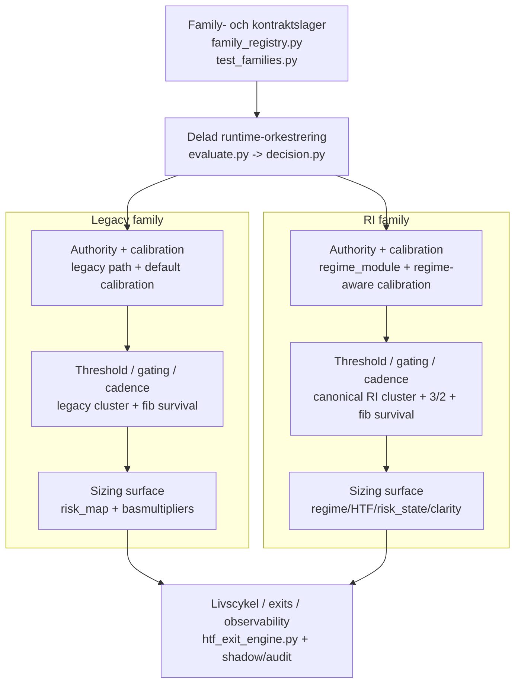

# RI vs legacy — rollkarta som två strategy families

Datum: 2026-03-20
Branch: `feature/ri-legacy-role-map-2026-03-19`
Status: arbetsdokument / analysunderlag / ingen runtime-ändring

## Syfte

Detta dokument sammanfattar den nuvarande, kodförankrade läsningen av `legacy` och `ri`.

Huvudtesen är:

- `strategy_family ∈ {"legacy", "ri"}`
- **legacy** och **RI** ska behandlas som två **separata strategy families**
- båda families kör genom samma övergripande runtime-orkestrering (`evaluate -> decide`)
- family-separationen sitter i authority, calibration, threshold, cadence, survival och sizing

Detta dokument säger alltså **inte** att det finns två helt olika runtime-motorer. Det säger att det finns **en delad backbone** med **två separata strategiytor** ovanpå.

## Kärndom

Den viktigaste slutsatsen är:

> **RI är en separat strategy family, inte ett lager ovanpå legacy.**

Och den operativa konsekvensen för research/backtest/Optuna är:

> **Legacy och RI ska köras som separata challenger-spår, inte som en gemensam mixed-family Optuna-sökning och inte som "RI ovanpå champion".**

## Delad orkestrering, separata families

Den delade huvudkedjan är fortfarande:

1. `src/core/strategy/evaluate.py`
2. `src/core/strategy/prob_model.py`
3. `src/core/strategy/confidence.py`
4. `src/core/strategy/decision.py`
   - `decision_gates.py`
   - `decision_fib_gating.py`
   - `decision_sizing.py`
5. exit-/livscykelytor, inklusive `src/core/backtest/htf_exit_engine.py`

Men det betyder inte att behavior är samma. Family-separationen realiseras genom olika:

- family-signaturer
- authority/calibration-paths
- threshold-kluster
- cadence/gating
- sizing-surfaces

## Mermaid — översiktskarta

Praktisk läsregel:

1. **Kontraktet** avgör vilken family som är giltig.
2. **Backbone** kör den delade pipeline-ordningen.
3. **Family-ytorna** är där legacy och RI faktiskt divergerar.
4. **Livscykel/observability** fullbordar och granskar beteendet nedströms.

## Legacy family

Legacy ska läsas som en **full strategy family**.

Typiska family-drag:

- authority-path: legacy
- default calibration
- legacy threshold family
- legacy cadence/gates
- sizing via `risk_map` + legacy-baserade multipliers

Legacy är alltså inte bara "det gamla entry-lagret" utan en komplett strategi-familj med egen sammanhängande surface.

## RI family

RI ska också läsas som en **full strategy family**.

Typiska family-drag:

- `multi_timeframe.regime_intelligence.authority_mode = regime_module`
- regime-aware calibration
- RI-native threshold surface
- `thresholds.signal_adaptation.atr_period = 14`
- `gates.hysteresis_steps = 3`
- `gates.cooldown_bars = 2`
- sizing-surface med regime-/HTF-/risk_state-/clarity-drag

RI är alltså inte en liten overlay-konfiguration. Det är en separat family med egen topology.

## Divergenspunkter mellan families

| Lager           | Legacy                   | RI                               | Varför det skiljer families              |
| --------------- | ------------------------ | -------------------------------- | ---------------------------------------- |
| Family-signatur | `strategy_family=legacy` | `strategy_family=ri`             | Family-registry förbjuder hybrider       |
| Authority       | legacy path              | `regime_module`                  | ändrar regime-input tidigt               |
| Calibration     | default                  | regime-aware                     | kan flytta kandidatunderlaget tidigt     |
| Thresholds      | legacy cluster           | RI cluster                       | samma inputs kan ge olika trade/no-trade |
| Cadence         | legacy gates             | `3/2`                            | ändrar kandidatöverlevnad                |
| Survival        | legacy fib surface       | RI fib surface                   | olika permission/survival-logik          |
| Sizing          | legacy risk-map yta      | RI risk_state/clarity/regime yta | family skiljer sig även post-candidate   |

## Projekt- och rollkarta

### 1. Family- och kontraktslager

Primära ytor:

- `src/core/strategy/family_registry.py`
- `tests/core/strategy/test_families.py`

Roll:

- definierar vilka strategy families som är giltiga
- förbjuder hybridlägen
- låser RI till canonical family-signatur

### 2. Delad runtime-orkestrering

Primära ytor:

- `src/core/strategy/evaluate.py`
- `src/core/strategy/decision.py`

Roll:

- bär den delade backbone-kedjan
- orkestrerar features, authority, proba, confidence och decision
- ska vara tunn orkestrering, inte dold family-policy

### 3. Family-konditionerade beslutsytor

Primära ytor:

- `src/core/strategy/prob_model.py`
- `src/core/strategy/confidence.py`
- `src/core/strategy/decision_gates.py`
- `src/core/strategy/decision_fib_gating.py`
- `src/core/strategy/decision_sizing.py`

Roll:

- formar probability surface
- formar threshold/candidate surface
- formar structural survival
- formar cadence
- formar sizing surface

### 4. Livscykel, exits och observability

Primära ytor:

- `src/core/backtest/htf_exit_engine.py`
- shadow-/observability-spår

Roll:

- fullbordar position lifecycle
- gör family-beteendet granskbart
- bär inte huvudbeviset för family-spliten, men gör den mätbar nedströms

## Operativ regel för backtest / Optuna

För fortsatt optimizer- och backtest-arbete gäller följande:

- kör **legacy** och **RI** som **separata challenger-spår**
- blanda inte `strategy_family: legacy` och `strategy_family: ri` i samma studie
- behandla inte `authority_mode = regime_module` som en liten champion-overlay
- tolka inte hybrid/overlay-probes som giltiga promotionskandidater
- jämför varje family mot incumbent champion via governed comparison

## Samlad slutsats

Den mest robusta, kodförankrade dom som gäller nu är:

> **Legacy och RI ska beskrivas som två separata strategy families som realiseras genom samma `evaluate -> decide`-orkestrering men med olika family-signaturer, authority/calibration-paths och family-konditionerade threshold/gating/cadence/sizing-surfaces. Därför ska de också köras och utvärderas som separata challenger-spår.**
