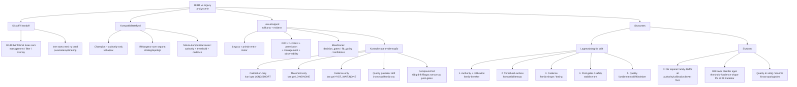

# Mermaid-karta — RI/R1 vs legacy analysrapport

Den här kartan sammanfattar huvudstrukturen och slutsatserna i `docs/analysis/ri_legacy_role_map_2026-03-20.md`.

```mermaid
---
id: 70982823-5b0a-4a87-843b-eaf229b12877
---
flowchart TD
    A["RI/R1 vs legacy<br/>analysserie"]

    A --> B["Kickoff / handoff"]
    A --> C["Kompatibilitetsfynd"]
    A --> D["Huvudrapport<br/>rollkarta + evidens"]
    A --> E["Slutsyntes"]

    B --> B1["R1/RI bör främst läsas som<br/>management / filter / overlay"]
    B --> B2["Inte starta med ny bred<br/>parameteroptimering"]

    C --> C1["Champion + authority-only<br/>kollapsar"]
    C --> C2["RI fungerar som separat<br/>strategitopologi"]
    C --> C3["Minsta kompatibla kluster:<br/>authority + threshold + cadence"]

    D --> D1["Legacy = primär entry-motor"]
    D --> D2["RI/R1 = context + permission<br/>+ management + observability"]
    D --> D3["Blandzoner:<br/>decision_gates / fib_gating / confidence"]
    D --> F["Kontrollerade evidensspår"]

    F --> F1["Calibration-only<br/>kan byta LONG/SHORT"]
    F --> F2["Threshold-only<br/>kan ge LONG/NONE"]
    F --> F3["Cadence-only<br/>kan ge HYST_WAIT/NONE"]
    F --> F4["Quality påverkar drift<br/>inom vald family-yta"]
    F --> F5["Compound-fall:<br/>tidig drift fångas senare av post-gates"]

    E --> G["Lagerordning för drift"]
    G --> G1["1. Authority + calibration<br/>family-breaker"]
    G --> G2["2. Threshold-surface<br/>kompatibilitetsyta"]
    G --> G3["3. Cadence<br/>family-shape / timing"]
    G --> G4["4. Post-gates / safety<br/>stabiliserare"]
    G --> G5["5. Quality<br/>familjeintern driftfördelare"]

    E --> H["Slutdom"]
    H --> H1["RI blir separat family därför att<br/>authority/calibration bryter först"]
    H --> H2["RI kräver därefter egen<br/>threshold-/cadence-shape för att bli tradebar"]
    H --> H3["Quality är viktig men inte<br/>första topologisöm"]
```
